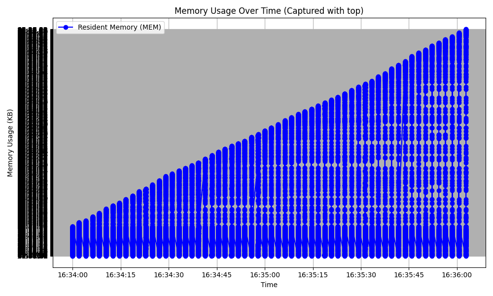

# Heap Fragmentation Experiment

This experiment simulates **heap fragmentation** by allocating and freeing memory blocks of varying sizes. The objective is to show how heap fragmentation can lead to **increased memory usage** over time, which may not be properly reclaimed by the system.

### Experiment Details:

- The program allocates memory blocks in the range of **1 KB to 1 MB** and periodically frees random blocks to simulate memory fragmentation.
- The memory usage is tracked with `top` (and optionally `htop`), which allows us to monitor how **resident memory** (RAM) and **compressed memory** evolve over time.
- The program prints memory statistics periodically and generates a plot showing **memory usage** over time.

---

## Problem Explanation

### **Heap Fragmentation**

Heap fragmentation occurs when dynamically allocated memory is freed, but the space is not reused efficiently due to fragmentation. This results in **unused memory** that cannot be reclaimed by the system, leading to **higher memory usage**. Over time, this can degrade performance and cause **memory leaks**.

In this experiment, we allocate and free random blocks of memory to simulate fragmentation. The program tracks the total memory allocated and the number of active memory blocks, printing statistics at regular intervals. The effect of fragmentation is visualized using **`top`** and **`htop`**.

---

## CSV Data Example

The CSV data includes the following columns:
```
Timestamp,PID,COMMAND,MEM,PURG,CMPRS
1745251322.601515,VM:,298T,"swapins,",81373606(0),swapouts.
1745251322.601801,620,WindowServer,2455M,832K,1819M
1745251322.602064,1212,Preview,1378M,0B,1252M
1745251322.602141,51788,Electron,1348M,0B,1220M
1745251322.602196,3266,Telegram,935M,0B,793M
1745251322.60224,1202,Google,8937,639M,0B
```

You can observe that **MEM** shows the memory usage of the process, **PURG** is the purgeable memory, and **CMPRS** indicates the compressed memory.

---

## Build & Run

### Prerequisites:
1. **G++** (C++ compiler)
2. **Python 3** with `matplotlib` and `pandas`
3. **htop** (optional, but recommended for live monitoring)

#### Installing `htop`:

If `htop` is not installed, you can install it via Homebrew on macOS:

```bash
brew install htop
```

#### 1. **Building the C++ Program**

First, compile the C++ program:

```bash
g++ -std=c++17 -O2 main.cpp -o fragdemo
```

#### 2. **Running the Program**

Run the program in one terminal:

```bash
./fragdemo
```

#### 3. **Monitoring with `top` and `htop`**

- **Option 1**: Open a new terminal and run `top` to observe the memory usage:

```bash
top -o mem
```

- **Option 2**: If you prefer a more interactive and colorful experience, use `htop`:

```bash
sudo htop
```

While the program runs, you will see memory usage increasing as more blocks are allocated and freed.

---

## Python Script to Monitor and Visualize

Python script is sued to capture memory usage data and to generate a plot to visualize it.



---

## Conclusion:

- The **heap fragmentation experiment** simulates memory allocation and deallocation, visualizing how memory usage increases over time.
- The program shows that memory is **not efficiently released** during fragmentation, causing high **resident memory usage** even after the program finishes.
- By using `top` and `htop`, you can monitor memory usage in real-time, while the Python scripts help you collect data and visualize it.

---
